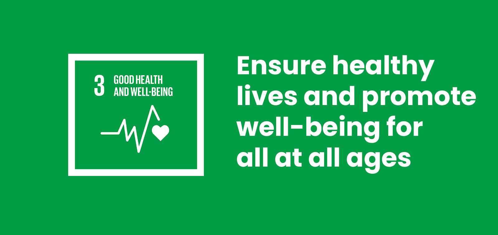
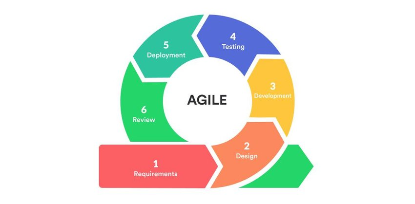
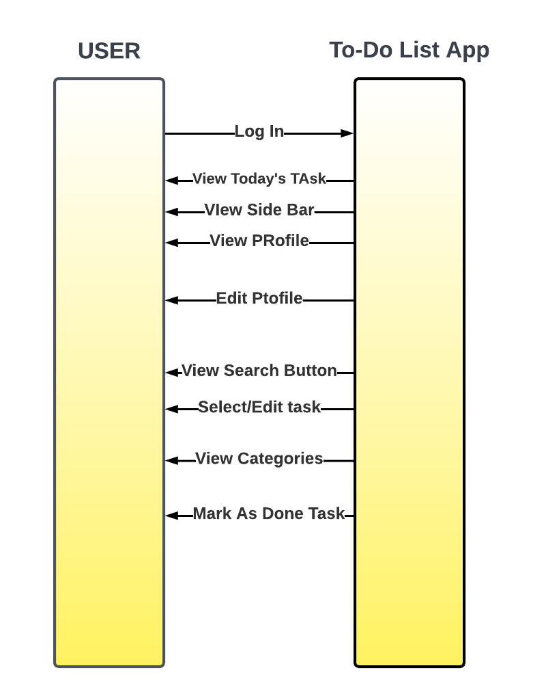
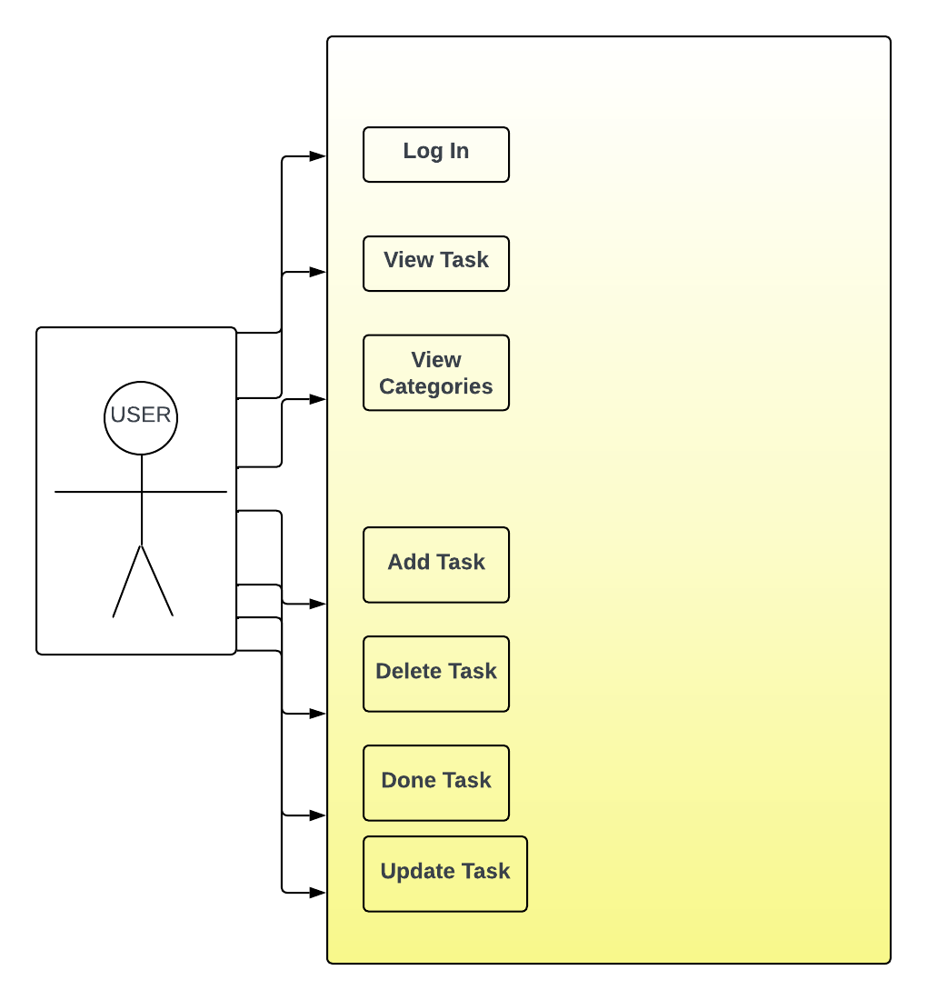
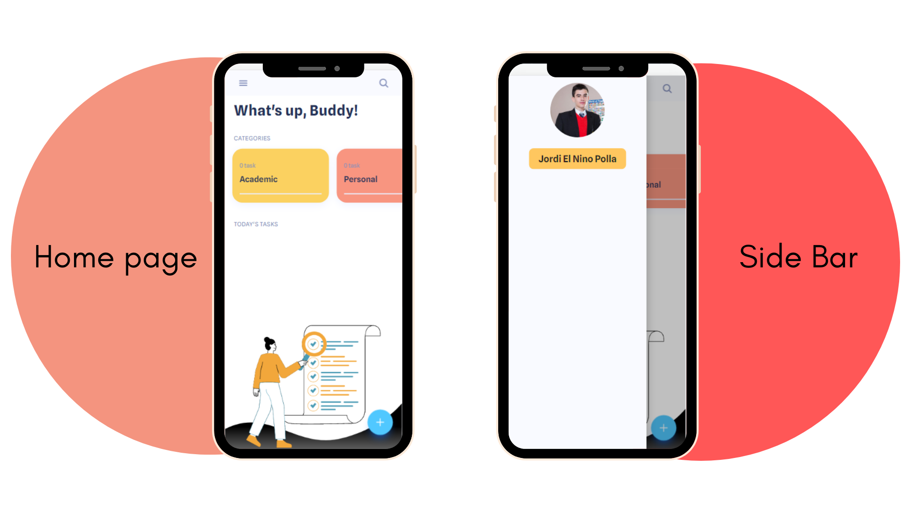
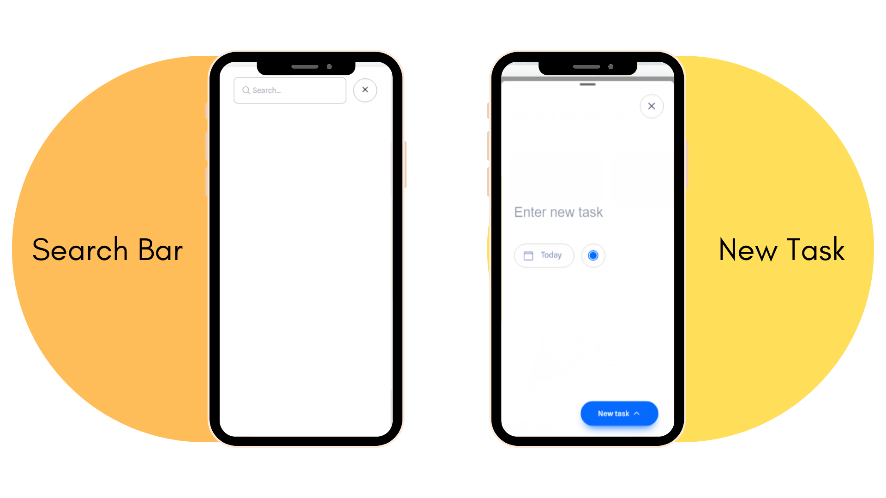

  

  
# To-Do List App
  

## Project Description

  A To-Do List app acts as a digital task manager, providing a centralized platform to list all our tasks, and projects. With just a few taps, we can create new tasks, and add relevant details, such as notes or attachments. This ease of use makes the app highly accessible to all users, regardless of their technological proficiency. 

In a world of continual distractions and rising demands on our time, a To-Do List app emerges as a vital ally in the search of productivity and organization. Its features, which include task creation and organization, task management capabilities, reminders and notifications, and sorting and filtering choices, combine to provide individuals with a strong task management solution. Users can improve their productivity, reduce stress, and fulfill their goals with greater ease by using a To-Do List app.

By making use of this digital tool, we can reduce stress, make better use of our time, and experience a feeling of achievement, leading to a more balanced and rewarding lifestyle. Embracing the To-Do List app is a significant move towards managing our tasks effectively, achieving our objectives, and regaining command over our everyday routines.

The To-Do List app doesn't directly solve healthcare access or disease problems, but it indirectly contributes to SDG 3 by promoting well-being. It helps reduce stress, manage time better, encourage healthy habits, and improve productivity. By supporting personal well-being, the app contributes to the larger goal of promoting a healthier lifestyle for all.

## Development Model

### Requirements
Determine what features the To-Do List app needs, like task creation, organization, reminders, collaboration, and device syncing.

### Design
Create a user-friendly interface with an easy-to-navigate layout, clear visual elements, and a pleasant overall look and feel.

### Development
Build the app using the chosen programming languages and frameworks, implementing the required features and ensuring compatibility across different devices and platforms.

### Testing
Check the app thoroughly to ensure it works properly, performs well, and meets user expectations through various tests like functionality, usability, performance, and compatibility.

### Deployment
Make the app available to users through app stores or web hosting platforms, following any guidelines or requirements specific to each distribution channel.

### Review
Collect user feedback to understand how the app is performing, address any issues or requests, and continuously improve the app based on user input.

## System Architecture

### Sequence diagram

  

### Use Case Diagram

  

  The diagrams above were created by the team to demonstrate how users interact with the program. It indicates that the user can view all categories to add and select the task, choose the main priority in the task. The User can also delete and edit Task.

## Application Screenshot

  

  

## Team Members

  

## Source Code
https://drive.google.com/file/d/1i6RG-NRAYX8_e7f648Wp0IJVJQZyeCMe/view
